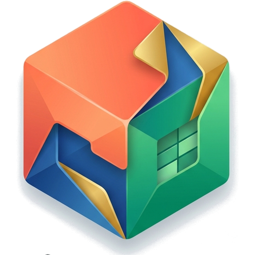

# Editor
### Suíte de Escritório Nacional, Gratuita, Local-First e Privada (Word, Excel, PowerPoint, PDF)

<p align="center">
  
</p>

<p align="center">
  <a href="https://github.com/editor-app-br/editor-website/actions/workflows/ci.yml"></a>
  <a href="./LICENSE.txt"></a>
  <a href="https://prata.dev.br"></a>
  <a href="https://nodejs.org"></a>
  <a href="https://nextjs.org"></a>
  <a href="https://github.com/editor-app-br/editor-website"></a>
  <a href="https://editor.app.br"></a>
</p>

---

## 🇧🇷 Sobre o Projeto: O Editor Livre do Brasil

O **editor.app.br** é uma suíte nacional de documentos para escritório, adaptada e aprimorada **voluntariamente por desenvolvedores brasileiros em regime comunitário**.

Nossa missão é garantir que **todas as categorias de usuários no Brasil** — cidadãos, estudantes, professores, advogados, profissionais liberais, microempreendedores, empresas e órgãos públicos — tenham acesso irrestrito, gratuito e de alta fidelidade a ferramentas completas de edição de documentos, sem barreiras financeiras ou dependência de assinaturas proprietárias caras.

### Principais Diferenciais:
- **Zero-Knowledge & Privacidade Absoluta:** O editor executa **100% no navegador do usuário** via WebAssembly (WASM). Seus documentos **nunca** são transmitidos, lidos ou armazenados em servidores externos.
- **Suporte Total aos Formatos Office:** Compatibilidade nativa com arquivos `.docx` (Word), `.xlsx` (Excel), `.pptx` (PowerPoint) e visualização/conversão de `.pdf`.
- **PWA & Funcionamento Offline:** Pode ser instalado como aplicativo no Windows, macOS, Linux, Android e iOS, continuando funcional mesmo sem internet.
- **Thin-Embed API (`/embed`):** Permite que qualquer sistema externo incorpore o editor diretamente via `<iframe>` e `postMessage`, com custo zero ($0) de licença comercial.

---

## 🏢 Patrocínio Institucional e Mantenedor

O desenvolvimento, infraestrutura de servidores e manutenção deste projeto público são patrocinados por:

- **Empresa:** **PRATA CONSULTORIA EM TECNOLOGIA DA INFORMACAO LTDA**
- **CNPJ:** `48.889.573/0001-44`
- **Site Oficial:** [https://prata.dev.br](https://prata.dev.br)
- **Contato:** [contato@prata.dev.br](mailto:contato@prata.dev.br)

---

## 📜 Licença e Uso por Empresas (GNU AGPL v3)

Este projeto é um Software Livre distribuído sob os termos da licença **[GNU Affero General Public License v3.0](./LICENSE.txt)** (AGPL-3.0).

> **Aviso para Empresas e Integradores:**  
> Qualquer organização pública ou privada é livre para utilizar, integrar ou hospedar este editor. No entanto, deve **aderir estritamente aos termos da licença AGPL v3**, incluindo a **Seção 13** (obrigatoriedade de disponibilizar o código fonte correspondente e melhorias a todos os usuários que interagirem com o serviço em rede).

Consulte o documento **[LEGAL_NOTICE.md](./LEGAL_NOTICE.md)** para detalhes completos sobre conformidade, direitos autorais de componentes upstream (ONLYOFFICE™, baotlake/office-website e CryptPad) e limites jurídicos de isolamento.

---

## 🚀 Como Executar Localmente

### Pré-requisitos
- [Node.js](https://nodejs.org) versão 24 (Active LTS) ou superior
- [pnpm](https://pnpm.io) versão 9 ou superior (`corepack enable && corepack prepare pnpm@latest --activate`)

```bash
# 1. Clonar o repositório
git clone https://github.com/editor-app-br/editor-website.git
cd editor-website

# 2. Instalar as dependências
pnpm install

# 3. Executar o servidor de desenvolvimento
pnpm dev

# 4. Compilar para produção (Exportação estática)
pnpm build
```

Abra [http://localhost:3000](http://localhost:3000) no seu navegador.

Para permitir que um sistema parceiro controle `/embed` via `postMessage`:

- **Produção (Helm):** `embedPartner.hosts` e `embedPartner.url` no chart de deploy. O pod serve `/embed-partner.json`.
- **Local:** copie `.env.example` para `.env.local` (`NEXT_PUBLIC_EMBED_PARTNER_HOSTS` / `NEXT_PUBLIC_EMBED_PARTNER_URL`), ou edite `public/embed-partner.json`.

Sem isso, só este site, localhost e hosts desktop (Tauri) podem dirigir o embed.

---

## 🤝 Como Contribuir e Enviar Pull Requests

Contribuições da comunidade brasileira e global são muito bem-vindas! Se você deseja corrigir um bug, traduzir termos, melhorar a acessibilidade ou adicionar novos recursos:

1. **Faça um Fork** do projeto no GitHub: [https://github.com/editor-app-br/editor-website](https://github.com/editor-app-br/editor-website)
2. **Crie uma Branch** para sua modificação:
   ```bash
   git checkout -b feature/minha-melhoria
   ```
3. **Faça suas alterações e teste localmente:**
   ```bash
   pnpm build
   ```
4. **Faça o Commit** das suas alterações com mensagens claras:
   ```bash
   git commit -m "feat: adiciona suporte a novo atalho de teclado"
   ```
5. **Envie para o seu Fork:**
   ```bash
   git push origin feature/minha-melhoria
   ```
6. **Abra um Pull Request (PR)** detalhando as melhorias realizadas.

---

<p align="center">
  Feito com 💚 no Brasil pela comunidade de software livre.
</p>

